# Architecture

## 1. System Overview

**AI Assistant** is a local, command-line personal assistant written in Python.

The application is intentionally modular:

- `cli_ui.py` provides the main CLI, menus, command parsing, and orchestration.
- `gemini.py` handles Google Gemini chat responses.
- `news.py` retrieves NewsAPI articles and uses Gemini to summarize them.
- `weather.py` retrieves current weather data from OpenWeatherMap.
- `reminders.py` persists reminders locally and checks them in the background.
- `todo.py` provides local to-do CRUD operations.
- `config.py` stores and loads API keys and user preferences.

The current repository contains these Python modules directly at the project root. citeturn790650view0

### High-Level Architecture

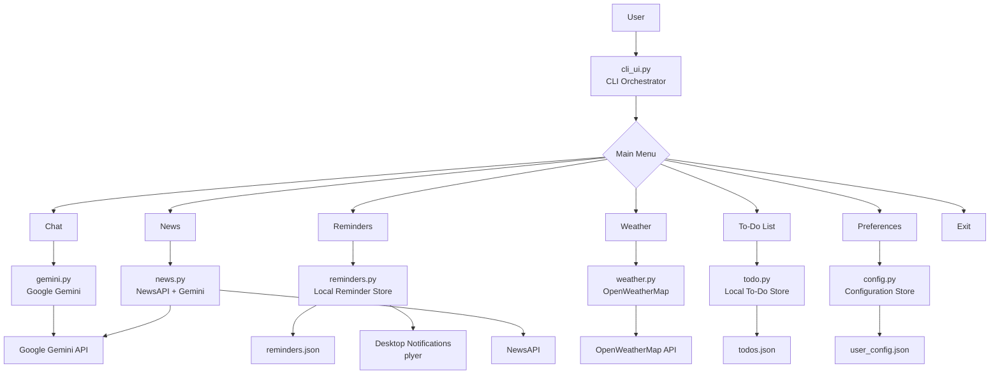
```mermaid
flowchart TD
    USER["User"] --> CLI["cli_ui.py<br/>CLI Orchestrator"]

    CLI --> MENU{"Main Menu"}

    MENU --> CHAT["Chat"]
    MENU --> REM["Reminders"]
    MENU --> NEWS["News"]
    MENU --> WEATHER["Weather"]
    MENU --> TODO["To-Do List"]
    MENU --> PREF["Preferences"]
    MENU --> EXIT["Exit"]

    CHAT --> GEMINI["gemini.py<br/>Google Gemini"]
    NEWS --> NEWSMOD["news.py<br/>NewsAPI + Gemini"]
    WEATHER --> WEATHERMOD["weather.py<br/>OpenWeatherMap"]
    REM --> REMMOD["reminders.py<br/>Local Reminder Store"]
    TODO --> TODOMOD["todo.py<br/>Local To-Do Store"]
    PREF --> CONFIG["config.py<br/>Configuration Store"]

    GEMINI --> GEMINI_API["Google Gemini API"]
    NEWSMOD --> NEWS_API["NewsAPI"]
    NEWSMOD --> GEMINI_API
    WEATHERMOD --> WEATHER_API["OpenWeatherMap API"]

    REMMOD --> REM_JSON["reminders.json"]
    TODOMOD --> TODO_JSON["todos.json"]
    CONFIG --> CONFIG_JSON["user_config.json"]

    REMMOD --> NOTIFY["Desktop Notifications<br/>plyer"]
```

The README describes the user-visible features as Gemini chat, reminders, personalized news, weather lookup, to-do management, and preference management. citeturn790650view0

---

# 2. Architectural Style

The project follows a **modular CLI architecture with service-style Python modules**.

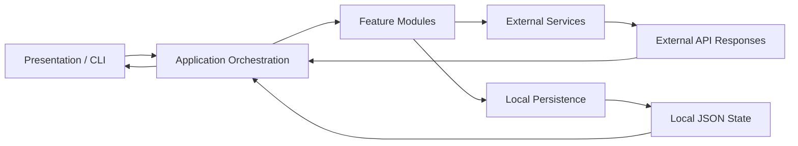
```mermaid
flowchart LR
    A["Presentation / CLI"] --> B["Application Orchestration"]
    B --> C["Feature Modules"]
    C --> D["External Services"]
    C --> E["Local Persistence"]
    D --> F["External API Responses"]
    E --> G["Local JSON State"]
    F --> B
    G --> B
    B --> A
```

### Main architectural responsibilities

| Layer | Responsibility | Main Files |
|---|---|---|
| CLI / Presentation | Menu, input, output, navigation | `cli_ui.py` |
| Orchestration | Routes user actions to feature modules | `cli_ui.py` |
| AI Service | Gemini model interaction | `gemini.py` |
| News Service | News retrieval + AI summarization | `news.py` |
| Weather Service | Current weather retrieval | `weather.py` |
| Reminder Service | Reminder CRUD + due-time checks | `reminders.py` |
| To-Do Service | To-do CRUD | `todo.py` |
| Configuration | API keys + news preferences | `config.py` |
| Local State | JSON persistence | `user_config.json`, `reminders.json`, `todos.json` |

---

# 3. Repository Structure

The current repository contains:

```text
ai_chatbot/
│
├── README.md
├── cli_ui.py
├── config.py
├── gemini.py
├── news.py
├── reminders.py
├── todo.py
└── weather.py
```

The current GitHub tree lists exactly these application files on the `main` branch. citeturn790650view0

The application also creates local JSON state files at runtime:

```text
ai_chatbot/
│
├── user_config.json      # created/used by config.py
├── reminders.json       # used by reminders.py
└── todos.json            # used by todo.py
```

These runtime files are implemented by the application modules even though they are not shown as source files in the current repository tree. citeturn509969view5turn873803view3turn873803view4

---

# 4. Application Entry Point

The documented entry point is:

```bash
python cli_ui.py
```

The runtime sequence is:

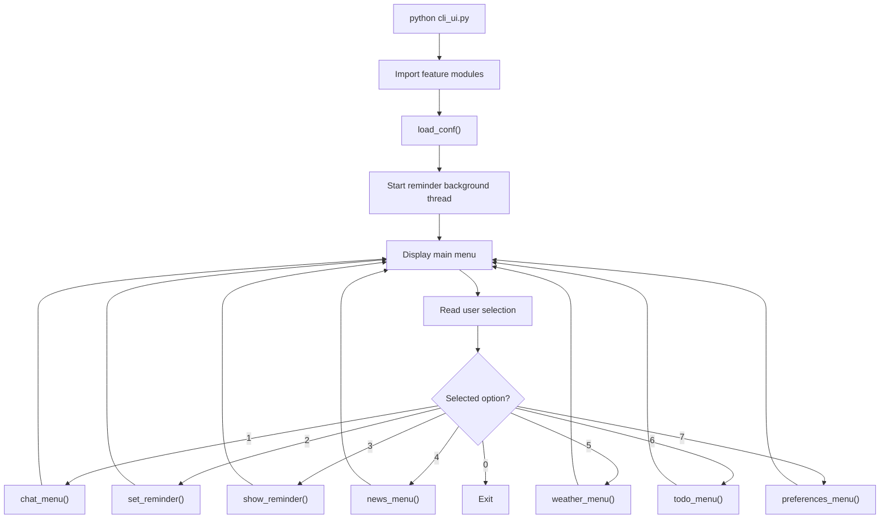
```mermaid
flowchart TD
    START["python cli_ui.py"] --> IMPORT["Import feature modules"]
    IMPORT --> CONFIG_LOAD["load_conf()"]
    CONFIG_LOAD --> THREAD["Start reminder background thread"]
    THREAD --> MENU["Display main menu"]
    MENU --> INPUT["Read user selection"]
    INPUT --> ROUTE{"Selected option?"}

    ROUTE -->|"1"| CHAT["chat_menu()"]
    ROUTE -->|"2"| SETREM["set_reminder()"]
    ROUTE -->|"3"| SHOWREM["show_reminder()"]
    ROUTE -->|"4"| NEWS["news_menu()"]
    ROUTE -->|"5"| WEATHER["weather_menu()"]
    ROUTE -->|"6"| TODO["todo_menu()"]
    ROUTE -->|"7"| PREF["preferences_menu()"]
    ROUTE -->|"0"| END["Exit"]

    CHAT --> MENU
    SETREM --> MENU
    SHOWREM --> MENU
    NEWS --> MENU
    WEATHER --> MENU
    TODO --> MENU
    PREF --> MENU
```

The current `main()` starts the reminder loop in a daemon thread and then continuously processes menu selections. citeturn873803view1turn873803view2

---

# 5. Main CLI Architecture

The main menu provides seven operational areas plus exit:

```text
1. Chat
2. Set Reminder
3. Show Reminders
4. Get News
5. Weather
6. To-Do List
7. Preferences
0. Exit
```

These options are defined directly in `cli_ui.py`. citeturn982312view0

### Main Menu Flow

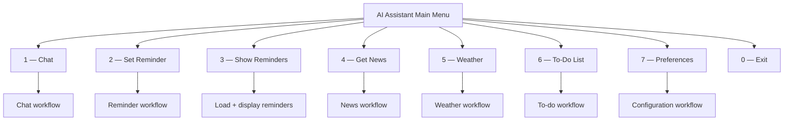
```mermaid
flowchart TD
    MAIN["AI Assistant Main Menu"]

    MAIN --> CHAT["1 — Chat"]
    MAIN --> SET["2 — Set Reminder"]
    MAIN --> SHOW["3 — Show Reminders"]
    MAIN --> NEWS["4 — Get News"]
    MAIN --> WEATHER["5 — Weather"]
    MAIN --> TODO["6 — To-Do List"]
    MAIN --> PREF["7 — Preferences"]
    MAIN --> EXIT["0 — Exit"]

    CHAT --> CHAT_FLOW["Chat workflow"]
    SET --> REM_FLOW["Reminder workflow"]
    SHOW --> REM_LIST["Load + display reminders"]
    NEWS --> NEWS_FLOW["News workflow"]
    WEATHER --> WEATHER_FLOW["Weather workflow"]
    TODO --> TODO_FLOW["To-do workflow"]
    PREF --> PREF_FLOW["Configuration workflow"]
```

---

# 6. Chat Architecture

The chat feature is implemented through `chat_menu()` in `cli_ui.py` and `chat_gemini()` in `gemini.py`.

The assistant uses the Google Gen AI Python SDK and the Gemini `gemini-2.5-flash` model. The Gemini API key is loaded from configuration first and can fall back to the `GEMINI_API_KEY` environment variable. citeturn509969view0

### Chat Flow

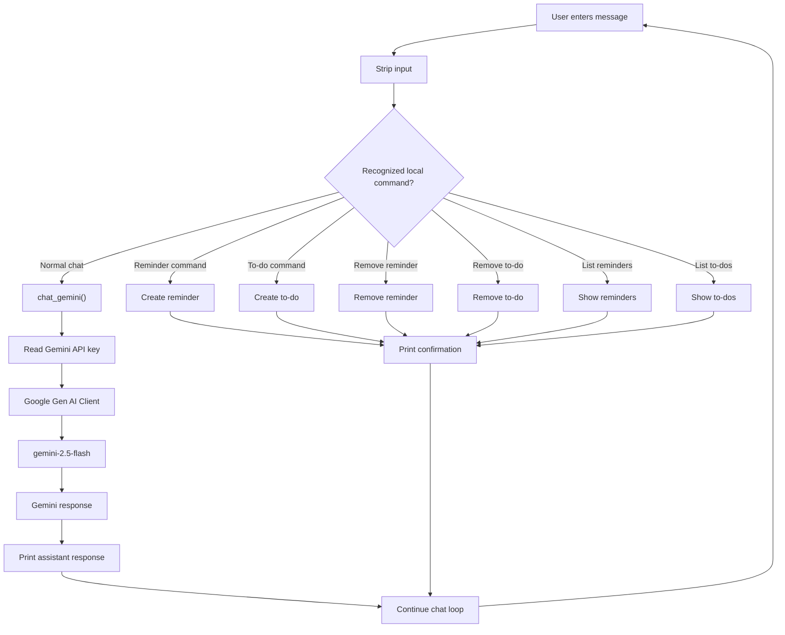
```mermaid
flowchart TD
    USERMSG["User enters message"] --> CLEAN["Strip input"]
    CLEAN --> CMD_CHECK{"Recognized local command?"}

    CMD_CHECK -->|"Reminder command"| REM_CMD["Create reminder"]
    CMD_CHECK -->|"To-do command"| TODO_CMD["Create to-do"]
    CMD_CHECK -->|"Remove reminder"| REM_REMOVE["Remove reminder"]
    CMD_CHECK -->|"Remove to-do"| TODO_REMOVE["Remove to-do"]
    CMD_CHECK -->|"List reminders"| REM_LIST["Show reminders"]
    CMD_CHECK -->|"List to-dos"| TODO_LIST["Show to-dos"]

    CMD_CHECK -->|"Normal chat"| GEMINI_CALL["chat_gemini()"]

    GEMINI_CALL --> KEY["Read Gemini API key"]
    KEY --> CLIENT["Google Gen AI Client"]
    CLIENT --> MODEL["gemini-2.5-flash"]
    MODEL --> RESPONSE["Gemini response"]
    RESPONSE --> PRINT["Print assistant response"]

    REM_CMD --> PRINT_LOCAL["Print confirmation"]
    TODO_CMD --> PRINT_LOCAL
    REM_REMOVE --> PRINT_LOCAL
    TODO_REMOVE --> PRINT_LOCAL
    REM_LIST --> PRINT_LOCAL
    TODO_LIST --> PRINT_LOCAL

    PRINT --> LOOP["Continue chat loop"]
    PRINT_LOCAL --> LOOP
    LOOP --> USERMSG
```

The current chat loop recognizes reminder and to-do patterns before falling back to `chat_gemini()` for general messages. citeturn873803view0turn873803view1

---

# 7. Local Command Parsing

The chat interface has lightweight regex-based command parsing.

The current implementation recognizes patterns for:

```text
add reminder ...
add to-do ...
remove reminder N
remove task N
show/list reminders
show/list to-dos
```

The parser is therefore a simple deterministic command layer placed **before** the Gemini call.

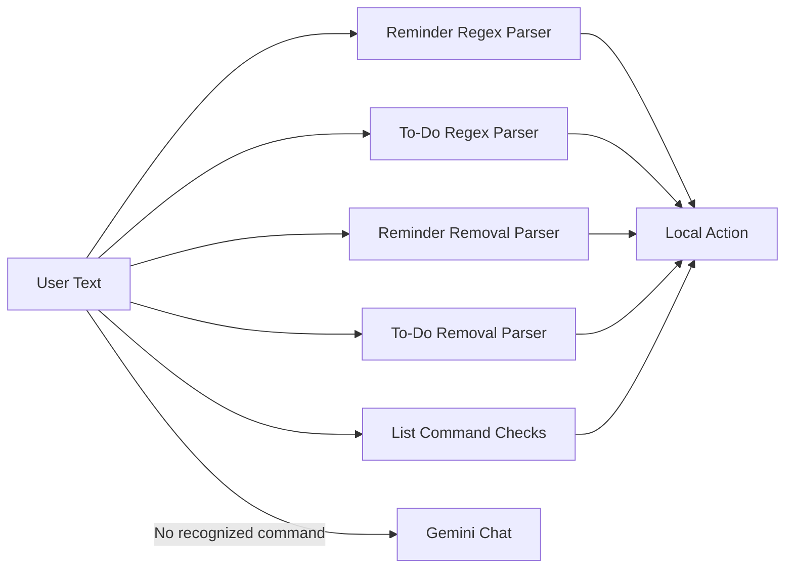
```mermaid
flowchart LR
    INPUT["User Text"] --> REMPARSE["Reminder Regex Parser"]
    INPUT --> TODOPARSE["To-Do Regex Parser"]
    INPUT --> REMREMOVE["Reminder Removal Parser"]
    INPUT --> TODOREMOVE["To-Do Removal Parser"]
    INPUT --> LISTCHECK["List Command Checks"]

    REMPARSE --> ACTION["Local Action"]
    TODOPARSE --> ACTION
    REMREMOVE --> ACTION
    TODOREMOVE --> ACTION
    LISTCHECK --> ACTION

    INPUT -->|"No recognized command"| AI["Gemini Chat"]
```

This design allows common assistant actions to execute locally without sending those command texts to the model. citeturn509969view6

---

# 8. Gemini Service Architecture

`gemini.py` encapsulates the external AI dependency.

### Responsibilities

- Load configuration.
- Obtain the Gemini API key.
- Create a Google Gen AI client.
- Submit the user's message.
- Return the model's text response.

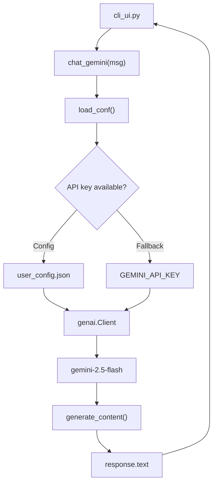
```mermaid
flowchart TD
    CHAT["cli_ui.py"] --> FUNC["chat_gemini(msg)"]
    FUNC --> CONF["load_conf()"]
    CONF --> KEYCHECK{"API key available?"}

    KEYCHECK -->|"Config"| CONFIGKEY["user_config.json"]
    KEYCHECK -->|"Fallback"| ENVKEY["GEMINI_API_KEY"]

    CONFIGKEY --> CLIENT["genai.Client"]
    ENVKEY --> CLIENT

    CLIENT --> MODEL["gemini-2.5-flash"]
    MODEL --> GENERATE["generate_content()"]
    GENERATE --> TEXT["response.text"]
    TEXT --> CHAT
```

The current implementation uses the Google `genai` client and configures a zero thinking budget for the Gemini request. citeturn509969view0

---

# 9. News Architecture

The news feature has a two-stage external-service pipeline:

```text
NewsAPI
   ↓
Article metadata
   ↓
Gemini
   ↓
Personalized summary
```

The module uses the stored news API key, requests up to three articles per topic, and sends each article title/description to Gemini with the user's preference as context. citeturn509969view1

### News Flow

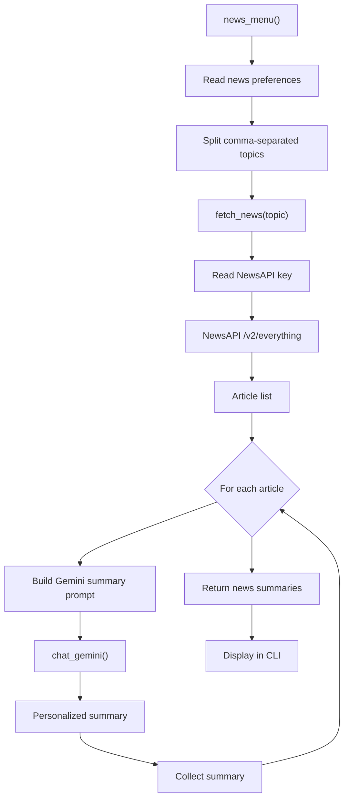
```mermaid
flowchart TD
    MENU["news_menu()"] --> PREF["Read news preferences"]
    PREF --> SPLIT["Split comma-separated topics"]

    SPLIT --> FETCH["fetch_news(topic)"]
    FETCH --> NEWSKEY["Read NewsAPI key"]
    NEWSKEY --> REQUEST["NewsAPI /v2/everything"]
    REQUEST --> ARTICLES["Article list"]

    ARTICLES --> ARTICLE_LOOP{"For each article"}
    ARTICLE_LOOP --> BUILD["Build Gemini summary prompt"]
    BUILD --> GEMINI["chat_gemini()"]
    GEMINI --> SUMMARY["Personalized summary"]

    SUMMARY --> RESULT["Collect summary"]
    RESULT --> ARTICLE_LOOP
    ARTICLE_LOOP --> OUTPUT["Return news summaries"]
    OUTPUT --> CLI["Display in CLI"]
```

---

# 10. Weather Architecture

`weather.py` is a lightweight API adapter around OpenWeatherMap.

The user supplies a city name, which is passed to the OpenWeatherMap current-weather endpoint using metric units. The response is formatted into a readable text result containing description, temperature, humidity, and pressure. citeturn509969view4

### Weather Flow

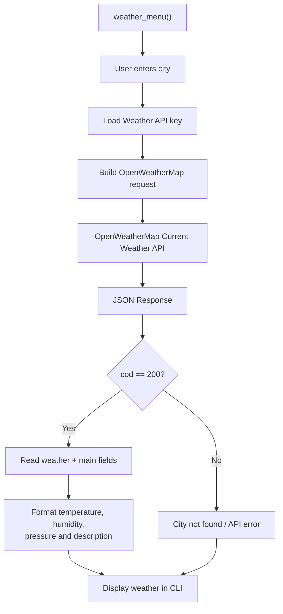
```mermaid
flowchart TD
    MENU["weather_menu()"] --> CITY["User enters city"]
    CITY --> APIKEY["Load Weather API key"]
    APIKEY --> PARAMS["Build OpenWeatherMap request"]
    PARAMS --> API["OpenWeatherMap Current Weather API"]
    API --> RESPONSE["JSON Response"]

    RESPONSE --> STATUS{"cod == 200?"}
    STATUS -->|"No"| ERROR["City not found / API error"]
    STATUS -->|"Yes"| PARSE["Read weather + main fields"]

    PARSE --> FORMAT["Format temperature, humidity,<br/>pressure and description"]
    FORMAT --> OUTPUT["Display weather in CLI"]
    ERROR --> OUTPUT
```

---

# 11. Reminder Architecture

Reminders are locally persisted in:

```text
reminders.json
```

Each reminder stores:

```json
{
  "text": "...",
  "due_time": 1234567890
}
```

The module provides functions for loading, saving, adding, displaying, and checking reminders. When a reminder becomes due, it is removed from the pending list and returned to the caller. citeturn873803view3

### Reminder Data Flow

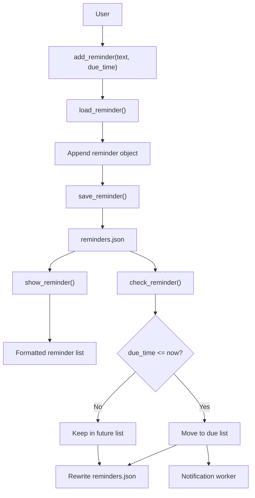
```mermaid
flowchart TD
    USER["User"] --> ADD["add_reminder(text, due_time)"]
    ADD --> LOAD["load_reminder()"]
    LOAD --> APPEND["Append reminder object"]
    APPEND --> SAVE["save_reminder()"]
    SAVE --> FILE["reminders.json"]

    FILE --> SHOW["show_reminder()"]
    SHOW --> DISPLAY["Formatted reminder list"]

    FILE --> CHECK["check_reminder()"]
    CHECK --> COMPARE{"due_time <= now?"}
    COMPARE -->|"No"| FUTURE["Keep in future list"]
    COMPARE -->|"Yes"| DUE["Move to due list"]

    FUTURE --> SAVE2["Rewrite reminders.json"]
    DUE --> SAVE2
    DUE --> NOTIFY["Notification worker"]
```

---

# 12. Background Reminder Architecture

A key architectural feature is the background reminder thread.

At application startup:

```text
main()
  ↓
threading.Thread(...)
  ↓
reminder_loop()
```

The reminder loop repeatedly checks for due reminders and sleeps for 30 seconds between checks. Due reminders are surfaced using `plyer.notification`. citeturn873803view1turn873803view3

### Background Execution Flow

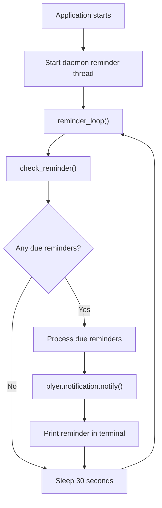
```mermaid
flowchart TD
    START["Application starts"] --> THREAD["Start daemon reminder thread"]
    THREAD --> LOOP["reminder_loop()"]
    LOOP --> CHECK["check_reminder()"]
    CHECK --> DUE{"Any due reminders?"}

    DUE -->|"No"| SLEEP["Sleep 30 seconds"]
    SLEEP --> LOOP

    DUE -->|"Yes"| EACH["Process due reminders"]
    EACH --> NOTIFY["plyer.notification.notify()"]
    NOTIFY --> PRINT["Print reminder in terminal"]
    PRINT --> SLEEP
```

This means reminder monitoring runs concurrently with the main CLI loop.

---

# 13. To-Do Architecture

The to-do module uses a local JSON file:

```text
todos.json
```

Each task is represented as:

```json
{
  "task": "Example task",
  "completed": false
}
```

The module supports:

- Add
- Show
- Mark complete
- Remove

These are implemented as direct CRUD-style operations over the local JSON list. citeturn873803view4

### To-Do Flow

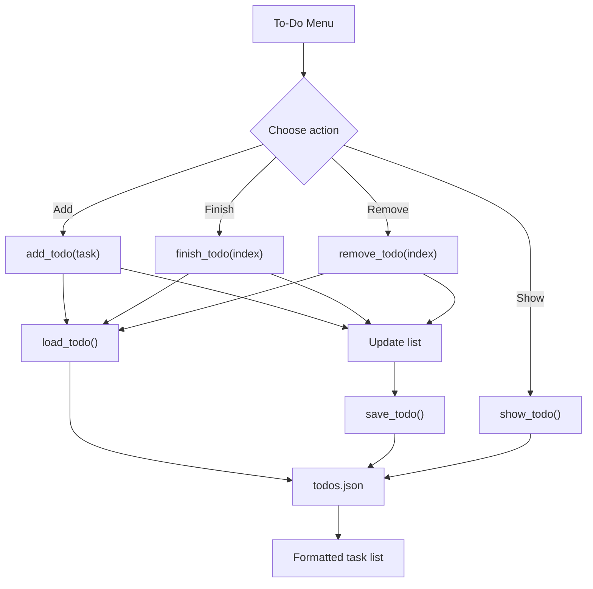
```mermaid
flowchart TD
    MENU["To-Do Menu"] --> ACTION{"Choose action"}

    ACTION -->|"Add"| ADD["add_todo(task)"]
    ACTION -->|"Show"| SHOW["show_todo()"]
    ACTION -->|"Finish"| FINISH["finish_todo(index)"]
    ACTION -->|"Remove"| REMOVE["remove_todo(index)"]

    ADD --> LOAD["load_todo()"]
    FINISH --> LOAD
    REMOVE --> LOAD

    LOAD --> FILE["todos.json"]

    ADD --> UPDATE["Update list"]
    FINISH --> UPDATE
    REMOVE --> UPDATE

    UPDATE --> SAVE["save_todo()"]
    SAVE --> FILE

    SHOW --> FILE
    FILE --> DISPLAY["Formatted task list"]
```

---

# 14. Preferences / Configuration Architecture

`config.py` centralizes user configuration.

The current default configuration contains:

- Google Gemini API key
- NewsAPI key
- Weather API key
- News preferences

The implementation stores this configuration in:

```text
user_config.json
```

If the file does not exist, `load_conf()` creates it using the default configuration. citeturn509969view5

### Configuration Flow

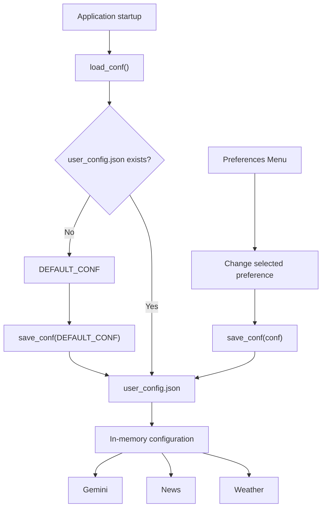
```mermaid
flowchart TD
    APP["Application startup"] --> LOAD["load_conf()"]
    LOAD --> EXISTS{"user_config.json exists?"}

    EXISTS -->|"No"| DEFAULT["DEFAULT_CONF"]
    DEFAULT --> CREATE["save_conf(DEFAULT_CONF)"]
    CREATE --> FILE["user_config.json"]

    EXISTS -->|"Yes"| FILE

    FILE --> CONF["In-memory configuration"]

    PREF["Preferences Menu"] --> CHANGE["Change selected preference"]
    CHANGE --> SAVE["save_conf(conf)"]
    SAVE --> FILE

    CONF --> GEMINI["Gemini"]
    CONF --> NEWS["News"]
    CONF --> WEATHER["Weather"]
```

The repository README mentions `config.json`, but the current implementation uses `user_config.json`; this architecture follows the actual code. citeturn790650view0turn509969view5

---

# 15. Preferences Menu Flow

The CLI allows the user to change:

```text
1. Google Gemini API key
2. NewsAPI key
3. Weather API key
4. News topics
```

The updated configuration is immediately persisted by `save_conf()`. citeturn982312view0turn509969view5

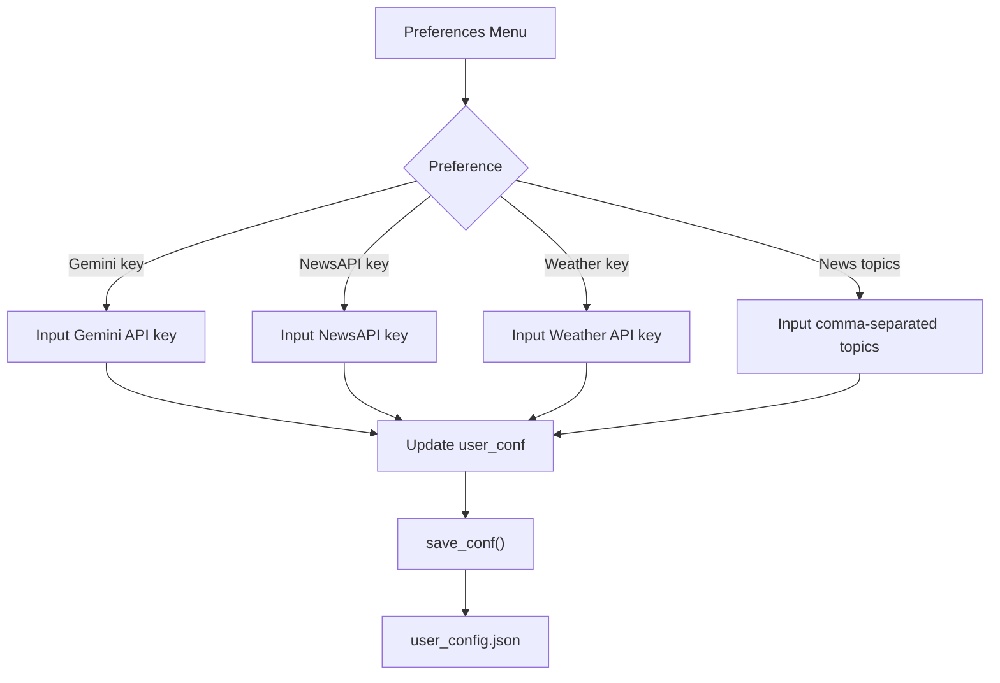
```mermaid
flowchart TD
    PREFMENU["Preferences Menu"] --> CHOICE{"Preference"}

    CHOICE -->|"Gemini key"| GKEY["Input Gemini API key"]
    CHOICE -->|"NewsAPI key"| NKEY["Input NewsAPI key"]
    CHOICE -->|"Weather key"| WKEY["Input Weather API key"]
    CHOICE -->|"News topics"| TOPICS["Input comma-separated topics"]

    GKEY --> UPDATE["Update user_conf"]
    NKEY --> UPDATE
    WKEY --> UPDATE
    TOPICS --> UPDATE

    UPDATE --> SAVE["save_conf()"]
    SAVE --> JSON["user_config.json"]
```

---

# 16. Complete User Interaction Architecture

The assistant provides both menu-driven and lightweight command-driven interactions.

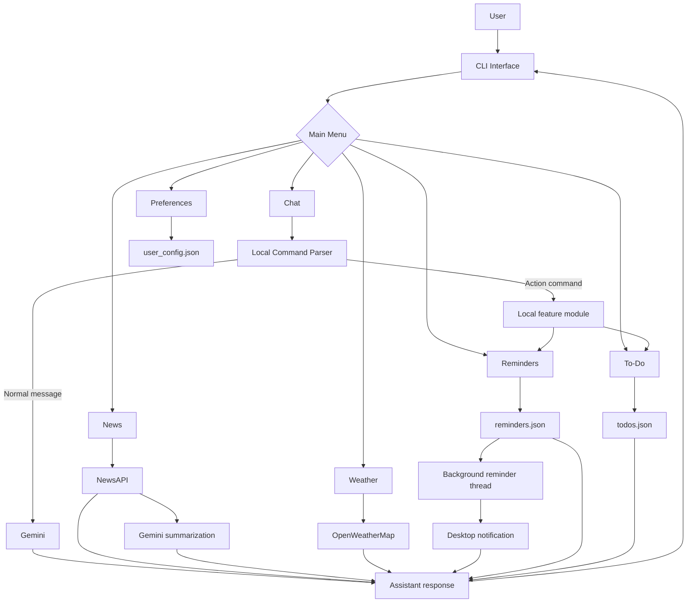
```mermaid
flowchart TD
    USER["User"] --> CLI["CLI Interface"]

    CLI --> MAIN{"Main Menu"}

    MAIN --> CHAT["Chat"]
    MAIN --> REM["Reminders"]
    MAIN --> NEWS["News"]
    MAIN --> WEATHER["Weather"]
    MAIN --> TODO["To-Do"]
    MAIN --> PREF["Preferences"]

    CHAT --> PARSER["Local Command Parser"]

    PARSER -->|"Action command"| LOCAL["Local feature module"]
    PARSER -->|"Normal message"| AI["Gemini"]

    LOCAL --> REM
    LOCAL --> TODO

    REM --> REM_STORE["reminders.json"]
    TODO --> TODO_STORE["todos.json"]
    PREF --> CONF_STORE["user_config.json"]

    NEWS --> NEWSAPI["NewsAPI"]
    NEWSAPI --> GEMINI["Gemini summarization"]

    WEATHER --> OPENWEATHER["OpenWeatherMap"]

    REM_STORE --> NOTIFIER["Background reminder thread"]
    NOTIFIER --> DESKTOP["Desktop notification"]

    AI --> RESPONSE["Assistant response"]
    NEWSAPI --> RESPONSE
    GEMINI --> RESPONSE
    OPENWEATHER --> RESPONSE
    DESKTOP --> RESPONSE
    REM_STORE --> RESPONSE
    TODO_STORE --> RESPONSE

    RESPONSE --> CLI
```

---

# 17. Module Dependency Architecture

The module relationships are intentionally simple.

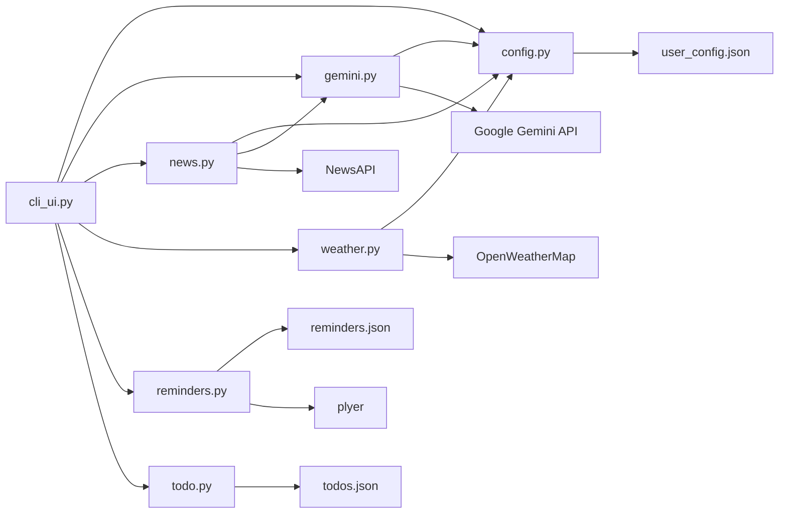
```mermaid
flowchart LR
    CLI["cli_ui.py"]

    CONFIG["config.py"]
    GEMINI["gemini.py"]
    NEWS["news.py"]
    WEATHER["weather.py"]
    REM["reminders.py"]
    TODO["todo.py"]

    CLI --> CONFIG
    CLI --> GEMINI
    CLI --> NEWS
    CLI --> WEATHER
    CLI --> REM
    CLI --> TODO

    GEMINI --> CONFIG
    NEWS --> CONFIG
    NEWS --> GEMINI
    WEATHER --> CONFIG

    REM --> REMJSON["reminders.json"]
    TODO --> TODOJSON["todos.json"]
    CONFIG --> CONFIGJSON["user_config.json"]

    GEMINI --> GOOGLE["Google Gemini API"]
    NEWS --> NEWSAPI["NewsAPI"]
    WEATHER --> OW["OpenWeatherMap"]
    REM --> PLYER["plyer"]
```

The repository code confirms these direct imports: `cli_ui.py` imports the feature modules; `news.py` depends on Gemini; and the weather/config/reminder/to-do modules use their respective helpers and local storage. citeturn982312view0turn509969view0turn509969view1turn509969view4turn873803view3turn873803view4

---

# 18. Data Ownership

Each feature has a clear data owner.

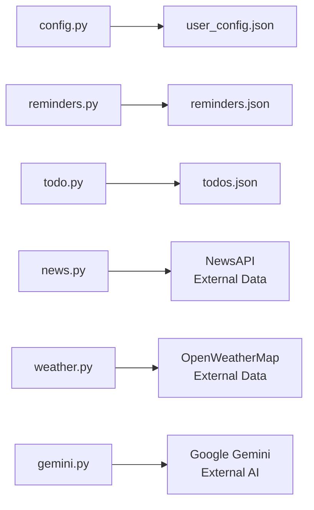
```mermaid
flowchart LR
    CONFIG["config.py"] --> CONFIGDB["user_config.json"]
    REM["reminders.py"] --> REMDB["reminders.json"]
    TODO["todo.py"] --> TODODB["todos.json"]

    NEWS["news.py"] --> NEWSAPI["NewsAPI<br/>External Data"]
    WEATHER["weather.py"] --> WEATHERAPI["OpenWeatherMap<br/>External Data"]
    GEMINI["gemini.py"] --> GEMINIAPI["Google Gemini<br/>External AI"]
```

### Local state

- `user_config.json`
- `reminders.json`
- `todos.json`

### External state/services

- Google Gemini
- NewsAPI
- OpenWeatherMap

---

# 19. Error / Fallback Architecture

The project uses lightweight defensive behavior rather than a centralized exception-management framework.

Examples:

```text
Missing config file
        ↓
Create default configuration

Missing / invalid reminders.json
        ↓
Return empty reminder list

Missing / invalid todos.json
        ↓
Return empty task list

Invalid weather response
        ↓
Return "City not found or API error."

Invalid CLI input
        ↓
Print "Invalid input." / "Invalid choice."
```

The reminder and to-do storage modules explicitly recover from missing or invalid JSON by returning empty lists. citeturn873803view3turn873803view4

---

# 20. Runtime Concurrency

The application has one foreground execution path and one background execution path.

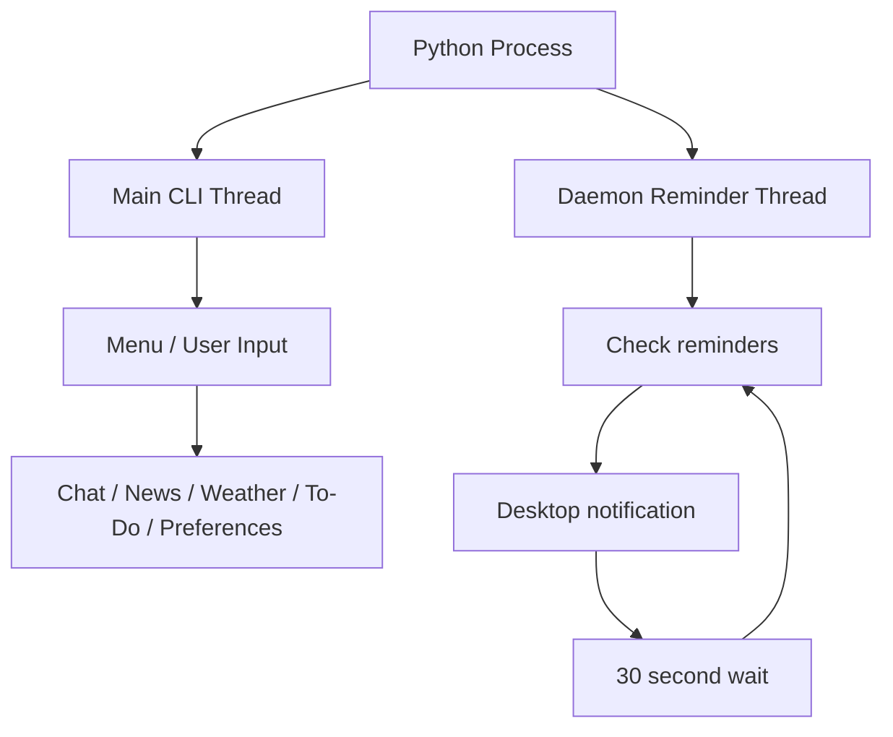
```mermaid
flowchart TD
    APP["Python Process"] --> MAIN["Main CLI Thread"]
    APP --> BG["Daemon Reminder Thread"]

    MAIN --> MENU["Menu / User Input"]
    MENU --> FEATURES["Chat / News / Weather / To-Do / Preferences"]

    BG --> CHECK["Check reminders"]
    CHECK --> NOTIFY["Desktop notification"]
    NOTIFY --> WAIT["30 second wait"]
    WAIT --> CHECK
```

### Foreground thread

Handles:

- User interaction
- Menu navigation
- API requests initiated by the user
- Local CRUD operations

### Background daemon thread

Handles:

- Periodic reminder checks
- Desktop notifications

`main()` starts the reminder worker as a daemon thread, so it runs alongside the CLI. citeturn873803view1

---

# 21. End-to-End Chat Request

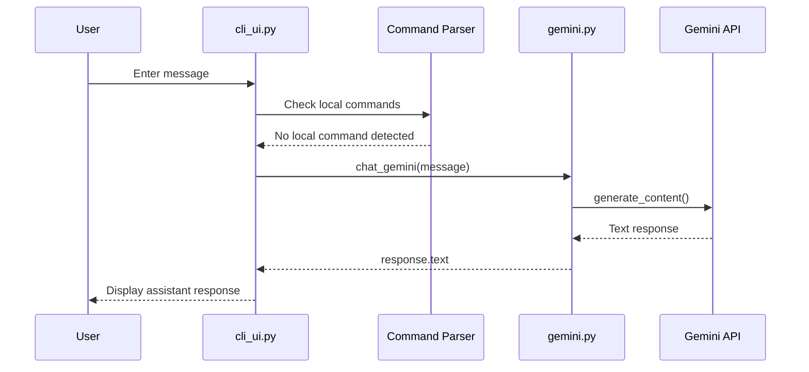
```mermaid
sequenceDiagram
    participant U as User
    participant C as cli_ui.py
    participant P as Command Parser
    participant G as gemini.py
    participant API as Gemini API

    U->>C: Enter message
    C->>P: Check local commands
    P-->>C: No local command detected
    C->>G: chat_gemini(message)
    G->>API: generate_content()
    API-->>G: Text response
    G-->>C: response.text
    C-->>U: Display assistant response
```

---

# 22. End-to-End News Request

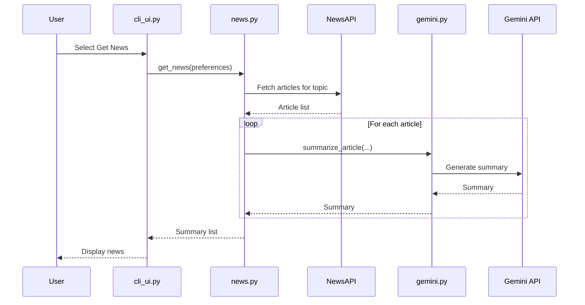
```mermaid
sequenceDiagram
    participant U as User
    participant C as cli_ui.py
    participant N as news.py
    participant NA as NewsAPI
    participant G as gemini.py
    participant GA as Gemini API

    U->>C: Select Get News
    C->>N: get_news(preferences)
    N->>NA: Fetch articles for topic
    NA-->>N: Article list

    loop For each article
        N->>G: summarize_article(...)
        G->>GA: Generate summary
        GA-->>G: Summary
        G-->>N: Summary
    end

    N-->>C: Summary list
    C-->>U: Display news
```

The current code uses NewsAPI for retrieval and Gemini for article summarization. citeturn509969view1

---

# 23. End-to-End Reminder Request

```mermaid
sequenceDiagram
    participant U as User
    participant C as cli_ui.py
    participant R as reminders.py
    participant F as reminders.json
    participant T as Background Thread
    participant P as plyer

    U->>C: Set reminder
    C->>R: add_reminder(text, due_time)
    R->>F: Save reminder
    R-->>C: Confirmation
    C-->>U: Reminder added

    loop Every 30 seconds
        T->>R: check_reminder()
        R->>F: Load reminders
        F-->>R: Pending reminders
        R-->>T: Due reminders
        T->>P: Desktop notification
    end
```

---

# 24. End-to-End To-Do Request

```mermaid
sequenceDiagram
    participant U as User
    participant C as cli_ui.py
    participant T as todo.py
    participant F as todos.json

    U->>C: Add / finish / remove task
    C->>T: CRUD operation
    T->>F: Load current list
    F-->>T: JSON state
    T->>F: Save updated list
    T-->>C: Result
    C-->>U: Display result
```

---

# 25. API Integration Architecture

The project integrates three external services.

```mermaid
flowchart TD
    APP["AI Assistant"]

    APP --> GEMINI["Google Gemini API"]
    APP --> NEWS["NewsAPI"]
    APP --> WEATHER["OpenWeatherMap"]

    GEMINI --> GEMINI_USE["General chat<br/>News summarization"]
    NEWS --> NEWS_USE["Fetch personalized topics"]
    WEATHER --> WEATHER_USE["Current weather"]

    GEMINI_USE --> OUT["CLI Output"]
    NEWS_USE --> OUT
    WEATHER_USE --> OUT
```

### External API responsibilities

| Service | Purpose | Module |
|---|---|---|
| Google Gemini | General chat + article summaries | `gemini.py`, `news.py` |
| NewsAPI | News retrieval | `news.py` |
| OpenWeatherMap | Current weather | `weather.py` |

---

# 26. Configuration and Secret Flow

API keys are required for the external services.

Current configuration behavior:

```mermaid
flowchart TD
    START["Application"] --> CONF["config.py"]
    CONF --> LOCAL["user_config.json"]

    LOCAL --> GKEY["Google Gemini API key"]
    LOCAL --> NKEY["NewsAPI key"]
    LOCAL --> WKEY["Weather API key"]
    LOCAL --> PREFS["News preferences"]

    GKEY --> GEMINI["Gemini Service"]
    NKEY --> NEWS["News Service"]
    WKEY --> WEATHER["Weather Service"]
```

The Gemini module additionally supports `GEMINI_API_KEY` as an environment-variable fallback. citeturn509969view0

For secure deployment, API secrets should preferably be injected through environment variables or another secret-management mechanism rather than committed to source control.

---

# 27. Feature-Level Architecture

## Chat

```mermaid
flowchart LR
    INPUT["Text Input"] --> PARSER["Local Command Parser"]
    PARSER -->|"Recognized command"| LOCAL["Local feature action"]
    PARSER -->|"Normal chat"| GEMINI["Gemini"]
    GEMINI --> RESPONSE["Text Response"]
```

## Reminders

```mermaid
flowchart LR
    INPUT["Reminder Input"] --> STORE["reminders.json"]
    STORE --> CHECK["Periodic Check"]
    CHECK --> NOTIFY["Desktop Notification"]
```

## News

```mermaid
flowchart LR
    PREF["News Topics"] --> API["NewsAPI"]
    API --> ARTICLES["Articles"]
    ARTICLES --> GEMINI["Gemini Summarization"]
    GEMINI --> OUTPUT["Personalized News"]
```

## Weather

```mermaid
flowchart LR
    CITY["City"] --> API["OpenWeatherMap"]
    API --> PARSE["Parse Weather JSON"]
    PARSE --> OUTPUT["Formatted Weather"]
```

## To-Do

```mermaid
flowchart LR
    ACTION["Add / Finish / Remove"] --> STORE["todos.json"]
    STORE --> OUTPUT["Updated To-Do List"]
```

---

# 28. Runtime State Model

The assistant maintains three categories of state.

```mermaid
flowchart TD
    STATE["Application State"]

    STATE --> MEMORY["In-Memory State"]
    STATE --> LOCAL["Local Persistent State"]
    STATE --> EXTERNAL["External Service State"]

    MEMORY --> USER_CONF["user_conf"]
    MEMORY --> CHAT_LOG["chat_log"]

    LOCAL --> CONFIG["user_config.json"]
    LOCAL --> REMINDERS["reminders.json"]
    LOCAL --> TODOS["todos.json"]

    EXTERNAL --> GEMINI_STATE["Gemini service"]
    EXTERNAL --> NEWS_STATE["NewsAPI"]
    EXTERNAL --> WEATHER_STATE["OpenWeatherMap"]
```

`cli_ui.py` keeps `user_conf` and a `chat_log` in memory, while the feature modules persist their durable state to local JSON files. citeturn982312view0turn509969view5turn873803view3turn873803view4

---

# 29. Important Implementation Detail

The README refers to a `config.json` file, but the current code uses:

```text
user_config.json
```

The architecture intentionally follows the **current implementation** because the actual module writes and reads `CONFIG_FILE = "user_config.json"`. citeturn509969view5

Similarly, `reminders.json` and `todos.json` are runtime-generated persistence files rather than source modules. citeturn873803view3turn873803view4

---

# 30. Extensibility Architecture

The current modular design makes additional assistant capabilities relatively straightforward to add.

A new feature can follow:

```mermaid
flowchart LR
    USER["CLI Menu / Command"] --> MODULE["New Feature Module"]
    MODULE --> SERVICE["External API or Local Logic"]
    SERVICE --> RESULT["Formatted Result"]
    RESULT --> CLI["cli_ui.py"]
```

For example:

```text
New Feature
    ↓
new_feature.py
    ↓
Add import in cli_ui.py
    ↓
Add menu / command
    ↓
Call feature function
    ↓
Display result
```

The existing architecture already follows this pattern through separate modules for Gemini, news, weather, reminders, to-dos, and configuration. citeturn790650view0

---

# 31. Maintenance Guidelines

When modifying the project:

1. Keep `cli_ui.py` focused on user interaction and orchestration.
2. Keep API-specific logic inside its corresponding module.
3. Keep local persistence inside the feature that owns the data.
4. Preserve the background reminder worker as a separate execution path.
5. Update the main menu when adding a new primary feature.
6. Keep API keys and other secrets outside source control.
7. Keep the configuration schema synchronized with `config.py`.
8. Update this `ARCHITECTURE.md` whenever module dependencies, persistence, external APIs, or runtime execution flow change materially.

---

# 32. Architecture at a Glance

```mermaid
flowchart TD
    USER["USER"]

    USER --> CLI["cli_ui.py<br/>CLI Orchestrator"]

    CLI --> CHAT["CHAT"]
    CLI --> REM["REMINDERS"]
    CLI --> NEWS["NEWS"]
    CLI --> WEATHER["WEATHER"]
    CLI --> TODO["TO-DO"]
    CLI --> PREF["PREFERENCES"]

    CHAT --> PARSER["Regex Command Parser"]
    PARSER --> LOCAL["Local Actions"]
    PARSER --> GEMINI["gemini.py"]
    GEMINI --> GAPI["Google Gemini API"]

    NEWS --> NEWSMOD["news.py"]
    NEWSMOD --> NAPI["NewsAPI"]
    NEWSMOD --> GEMINI

    WEATHER --> WEATHERMOD["weather.py"]
    WEATHERMOD --> OAPI["OpenWeatherMap"]

    REM --> REMMOD["reminders.py"]
    REMMOD --> REMJSON["reminders.json"]
    REMMOD --> THREAD["Background Reminder Thread"]
    THREAD --> PLYER["plyer Notification"]

    TODO --> TODOMOD["todo.py"]
    TODOMOD --> TODOJSON["todos.json"]

    PREF --> CONFIG["config.py"]
    CONFIG --> CONFIGJSON["user_config.json"]

    GAPI --> RESP["Assistant / AI Response"]
    NAPI --> RESP
    OAPI --> RESP
    PLYER --> RESP
    REMJSON --> RESP
    TODOJSON --> RESP

    RESP --> USER
```

---

# 33. Final Architecture Summary

The project is best understood as a **modular, local-first CLI assistant** with three types of capabilities:

```text
                    AI ASSISTANT
                         │
        ┌────────────────┼────────────────┐
        │                │                │
        ▼                ▼                ▼
   AI SERVICES      PRODUCTIVITY       INFORMATION
        │                │                │
        ▼                ▼                ▼
     Gemini       Reminders / To-Do   News / Weather
        │                │                │
        ▼                ▼                ▼
   External API      Local JSON       External APIs
        │                │                │
        └────────────────┼────────────────┘
                         ▼
                    cli_ui.py
                         │
                         ▼
                  Command Line User
```

The core execution model is:

```text
USER
  ↓
CLI MENU / CHAT INPUT
  ↓
COMMAND PARSING
  ↓
┌─────────────────────────────────────────────────┐
│                                                │
│  Local Feature               External Feature  │
│                                                │
│  Reminders ──► JSON         Gemini ──► API     │
│  To-Do ─────► JSON         News ────► API     │
│  Preferences ► JSON         Weather ─► API     │
│                                                │
└─────────────────────────────────────────────────┘
  ↓
RESULT / NOTIFICATION
  ↓
USER
```

### Core architectural principles

> **Modular services:** Each capability is isolated in its own Python module.

> **Local-first persistence:** Reminders, to-dos, and preferences are stored locally in JSON files.

> **External-service integration:** AI, news, and weather capabilities are backed by dedicated APIs.

> **Background execution:** Reminder monitoring runs independently from the interactive CLI.

> **Simple orchestration:** `cli_ui.py` is the central controller that connects user input to feature modules.

This structure keeps the assistant easy to understand, maintain, and extend while preserving a clear boundary between the CLI, feature logic, local persistence, and external APIs.
